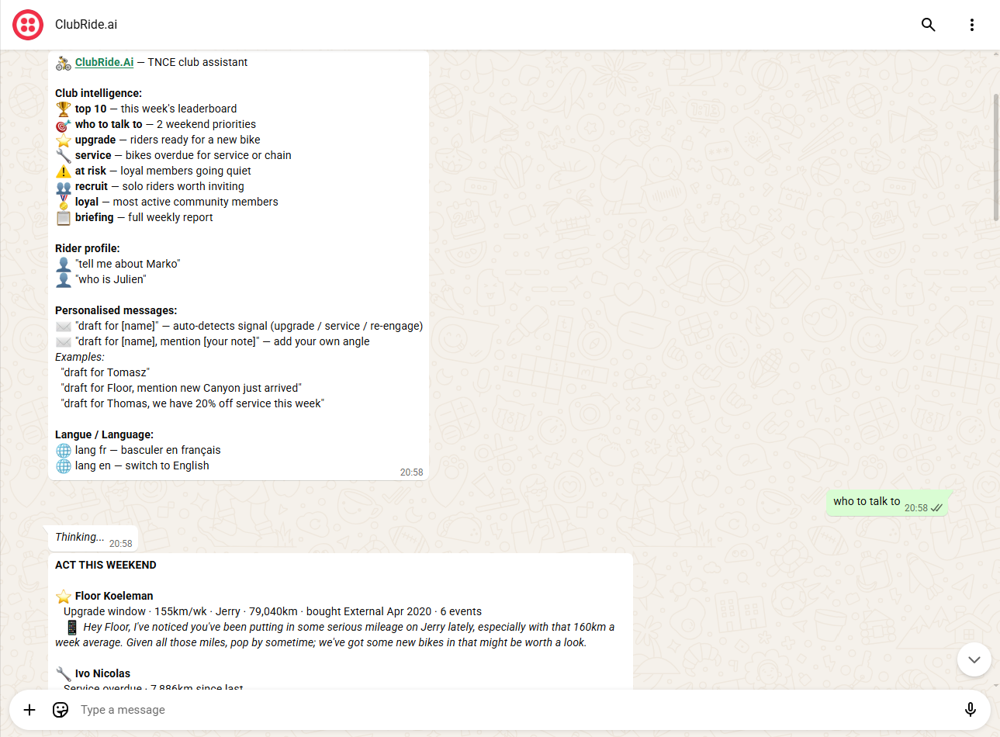
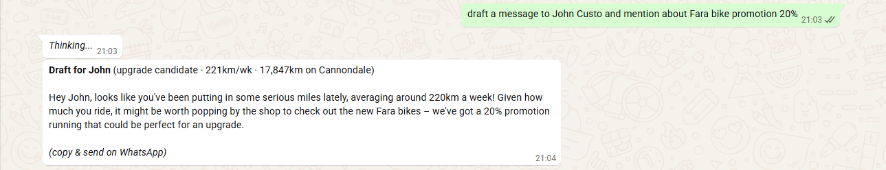
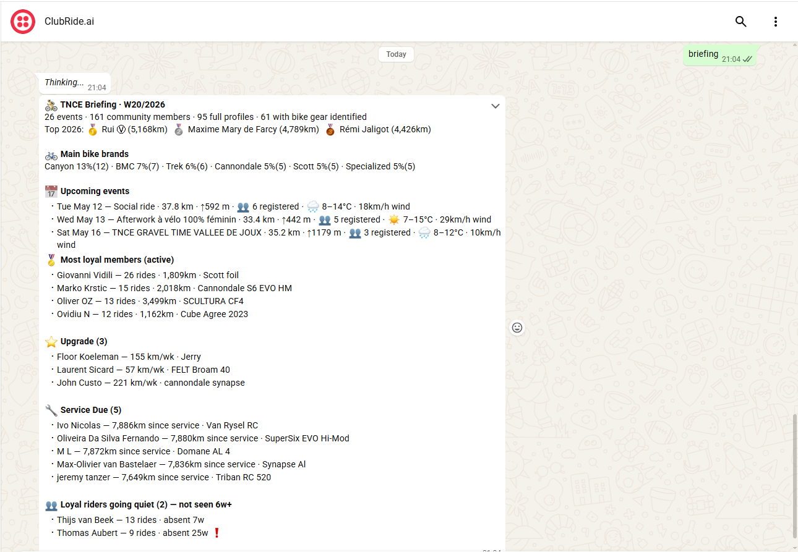

# ClubRide.Ai — Pitch Deck

### Turning Strava club data into bike shop revenue — via WhatsApp

**Aleksei Mironov · Founder · May 2026**

---

## 1. The Founder's Moment

I run a cycling club. I also work at a bike shop.

Every week, 160+ riders share their routes, their bikes, and their mileage on Strava. I can see who rode 200km this week on a five-year-old entry-level bike. I can see whose chain hasn't been replaced in 3,000km. I can see who stopped showing up after 18 months of faithful attendance.

But to act on any of it, I had to open Strava, cross-reference an attendance spreadsheet, remember who bought what bike and when — and then write a WhatsApp message from memory, hoping I had the right person.

I knew who to talk to. I just couldn't act on it fast enough, consistently enough, every single week.

So I built the tool I needed.

---

## 2. The Problem

**Bike shops with Strava clubs are sitting on a goldmine of behavioural data — and doing nothing with it.**

Every week, a cycling club generates clear, actionable signals:

- Who is riding hard on an ageing entry-level bike → **upgrade candidate**
- Whose bike hasn't been serviced in 7,000+ km → **service opportunity**
- Who attended 20 rides and then went silent → **churn risk**
- Which serious solo local rider isn't in the club yet → **recruitment target**

Today, shop owners either ignore this data entirely or process it manually — a 2-hour exercise every Friday that most skip. The result: warm leads go cold, service conversations never happen, regulars churn quietly.

**The gap: rich behavioural data, zero workflow to act on it.**

---

## 3. The Solution

**ClubRide.Ai turns your Strava club into a revenue-generating intelligence layer — delivered as a WhatsApp conversation.**

The shop owner sends one message. The bot replies with ranked candidates, signals, and a personalised WhatsApp message ready to forward — in under 3 seconds.

No dashboard. No login. No new app to learn. It works in the tool the owner already uses all day.

```
Owner → WhatsApp → ClubRide.Ai → Instant actionable answer
```

| Command | What you get |
|---|---|
| `who to talk to` | Top 2 weekend contacts with drafted messages |
| `upgrade` | Riders ready for a new bike |
| `service` | Bikes overdue for service or chain |
| `at risk` | Regulars who stopped showing up |
| `recruit` | Serious local solo riders worth inviting |
| `loyal` | Most active community members |
| `briefing` | Full weekly club intelligence report |
| `draft for [name]` | Personalised WhatsApp message, ready to forward |
| `draft for [name], mention [your note]` | Same — with your custom angle |

---

## 4. Live Demo

*All screenshots below are from a live WhatsApp conversation with ClubRide.Ai, connected to Club TNCE — Lausanne, Switzerland. 161 members. Running in production.*

---

### Friday morning: "who to talk to this weekend?"



Two contacts. Two signals. Two drafted messages. 3 seconds.

Floor Koeleman — 155 km/week on an ageing entry-tier bike. Upgrade window open.
Ivo Nicolas — 7,886 km since last service. Overdue conversation.

Both messages are ready to copy and forward on WhatsApp — no editing required.

---

### From signal to sale: the upgrade funnel



`upgrade` surfaces the candidates. One follow-up message adds a custom angle — a Fara bike promotion at 20%. The bot generates a personalised, ready-to-send message referencing John's exact weekly mileage and the specific promotion.

**This is the moment the 10% revenue share starts.**

---

### Friday briefing — the full club picture



26 events · 161 members · upcoming rides with weather forecast · most loyal members · 3 upgrade candidates · 5 service alerts — delivered as a single WhatsApp message, every Friday at 17:00.

The shop owner starts the weekend knowing exactly who to approach and why.

---

## 5. Traction

**ClubRide.Ai is live today, connected to a real club.**

| Metric | Value |
|---|---|
| Club | TNCE — Lausanne, Switzerland |
| Members | 161 active |
| Events in history | 26 |
| Full athlete profiles | 98 |
| Athletes with bike data | 64 |
| Upgrade signals (this week) | 3 |
| Service signals (this week) | 5 |
| Bot status | Live — WhatsApp via Twilio |
| Languages | EN, FR |
| Data freshness | Updated twice weekly |

This is not a mockup. Every number above comes from real Strava data, processed and delivered via WhatsApp in production today.

---

## 6. Market Opportunity

**Every premium cycling club has a shop owner who needs this.**

| Segment | Estimate |
|---|---|
| Strava cycling clubs globally | 100,000+ |
| Premium bike shops in Europe with active Strava clubs | ~5,000 |
| Average club size | 80–200 members |
| Average bike sale | CHF 3,000–5,000 |
| Revenue share per conversion (10%) | CHF 300–500 |

**Conservative revenue per shop per month:**
- 2 upgrade conversions × CHF 400 = CHF 800
- 3 service bookings × CHF 20 = CHF 60
- **~CHF 860/month per shop**, fully performance-based, zero fixed cost to the shop

| Scale | Monthly revenue share |
|---|---|
| 10 shops | CHF 8,600 |
| 50 shops | CHF 43,000 |
| 100 shops | CHF 86,000 |

We are starting with one club, one shop, one proof point.

---

## 7. Business Model

**Zero upfront cost to the shop. We earn when they earn.**

| | Pilot (3 months) | At scale |
|---|---|---|
| Setup cost | CHF 150 (infrastructure) | — |
| Revenue model | 10% of attributed bike sales | 10% revenue share + monthly SaaS fee |
| Revenue per conversion | CHF 400 (avg) | CHF 400 (avg) |
| Break-even for shop | 0 — no cost, only upside | — |
| Break-even for pilot | 1 bike sale | — |

**Why this model works:**
- Shop owner has zero financial downside
- Fully aligned incentives — the tool earns only when the shop earns
- One bike sale (CHF 400 share) covers the full 3-month pilot cost 2.6×
- Scales naturally: more conversions = more revenue = proof for the next shop

---

## 8. Competition

| | ClubRide.Ai | Generic CRM | Strava Business | Manual process |
|---|---|---|---|---|
| Cycling-specific signals | ✅ | ❌ | ❌ | ❌ |
| Zero-friction (WhatsApp) | ✅ | ❌ | ❌ | ✅ |
| Automated intelligence | ✅ | Partial | ❌ | ❌ |
| Personalised draft messages | ✅ | ❌ | ❌ | ❌ |
| Revenue-share model | ✅ | ❌ | N/A | N/A |
| Setup time | < 1 day | Weeks | N/A | Always |
| Cost to shop | Performance only | €50–500/mo | — | Owner's time |

**We are the only tool that connects Strava behavioural data directly to a shop owner's sales workflow.**

---

## 9. Roadmap

### Phase 1 — MVP (live today ✅)
- WhatsApp bot: upgrade, service, at-risk, recruit, loyal, briefing, draft messages
- Real Strava data: 98 athlete profiles across 26 events
- Natural language routing — any phrasing, EN and FR
- Privacy layer — all data local, never shared

### Phase 2 — Autonomous (Q3 2026)
- Auto-scheduler — Friday briefing sent automatically at 17:00
- Always-on cloud deployment (Render) — no manual startup
- Weekly scraper automation — data updates without intervention
- DE, IT language support

### Phase 3 — Real CRM (Q4 2026)
- Connect real shop POS and transaction data
- Accurate purchase history and real service records
- Revenue attribution tracking per bot interaction
- Multi-club, multi-owner support

---

## 10. Team

**Aleksei Mironov — Founder**

- **Operator** — runs Club TNCE (Lausanne), 160+ members, weekly rides
- **Shop insider** — direct access to the problem, the data, and the customer
- **Builder** — designed and built the full stack: Strava scraping, Gemini AI routing, WhatsApp delivery via Twilio
- **Skin in the game** — this tool runs on my club, with my data, this week

Commitment for the pilot: **20% of working time** — setup, data pipeline, iteration, and business validation.

---

## 11. The Ask

**CHF 150 to run a 3-month proof of concept.**

| | |
|---|---|
| Infrastructure cost | CHF 150 — 3 months of Render + Twilio + Gemini API |
| Founder time | 20% — onboarding, data updates, weekly iteration |
| Revenue model | 10% of bike sales attributed to the tool |
| Pilot duration | 3 months |
| Success metric | ≥ 3 attributed bike sales |

**Pilot timeline:**

| Month | Milestone |
|---|---|
| Month 1 | Tool live at the club. First upgrade and service signals identified. First conversations started. |
| Month 2 | Draft messages sent for warm leads. First sales opportunities tracked. |
| Month 3 | Conversions recorded. Revenue share calculated. Go/no-go for Phase 2. |

**The math:**
- 3 bike sales × CHF 4,000 avg × 10% = **CHF 1,200 revenue share**
- vs CHF 150 pilot cost = **8× return on the pilot**
- One sale on day one already pays back the full pilot **2.6×**

> *"CHF 150. 3 months. We only earn when you sell. One bike pays back the pilot on day one."*

---

## 12. Contact

**Aleksei Mironov**
aleksei.mironov@gmail.com
[github.com/alekseimironov/ClubRide.Ai](https://github.com/alekseimironov/ClubRide.Ai)

---

*Built with real data. Running in production. Ready to scale.*
